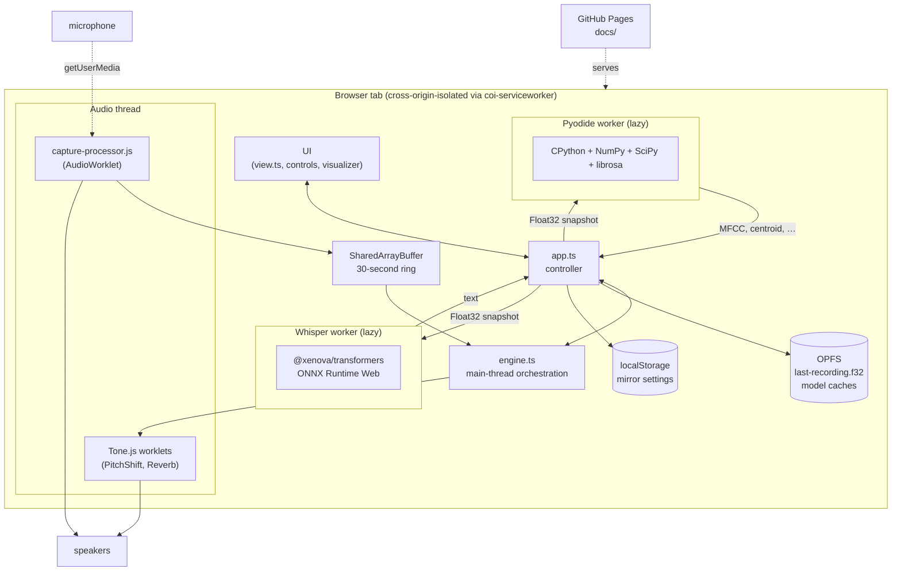

# Architecture



## Signal flow

The microphone feeds two paths in parallel:

1. **Live monitor** — `MediaStreamSource → liveGain → AudioContext.destination`. Heard immediately, no buffering.
2. **Capture ring** — `MediaStreamSource → capture-processor (AudioWorklet) → SharedArrayBuffer`. The worklet writes the latest 30 seconds of mono samples into a shared buffer.

When the user presses **Begin mirror**, the main thread snapshots the ring into an `AudioBuffer`, hands it to three `Tone.Player` instances, and connects each to its effect chain (slow / pitch / reverb). All three loop in sync with the live monitor.

## Threading

| Thread         | Responsibilities                                                                                        |
| -------------- | ------------------------------------------------------------------------------------------------------- |
| Audio          | `capture-processor`, Tone.js's `PitchShift` and `Reverb` worklet internals. No `await`, no GC pressure. |
| Main           | UI, render loop, OPFS, localStorage, Tone.js orchestration.                                             |
| Whisper worker | `@xenova/transformers` lifecycle. Lazy-loaded on first transcribe click.                                |
| Pyodide worker | CPython + librosa. Lazy-loaded on first analyse click.                                                  |

## Why this shape

- Audio quality is decoupled from WASM load times. The mirror works in seconds, before anything else is downloaded.
- Workers are independently disposable. A Pyodide bug never breaks the mirror.
- `SharedArrayBuffer` lets us read the ring without copying — important for the visualizer at 60 fps.
- The `coi-serviceworker` shim is the only way to get cross-origin isolation on GitHub Pages, and is necessary for `SharedArrayBuffer`. See `docs/adr/0006`.

## File map

```
src/
├── main.ts                  entry
├── app.ts                   wires view ↔ engine ↔ workers
├── primitives/              pure helpers (clamp, lerp, result, time)
├── audio/
│   ├── ring-buffer.ts       pure Float32 circular buffer
│   ├── shared-capture.ts    main-thread shim for the shared ring
│   ├── recorder.ts          getUserMedia + capture worklet wiring
│   ├── mirror-graph.ts      Tone.js graph (live, slow, pitch, reverb)
│   ├── transformations.ts   pure math + settings shape
│   └── engine.ts            orchestrates everything above
├── workers/
│   ├── whisper-types.ts     message shapes
│   ├── whisper.worker.ts    transformers.js inside a worker
│   ├── whisper-client.ts    main-thread client
│   ├── pyodide-types.ts     message shapes
│   ├── pyodide.worker.ts    Pyodide + librosa inside a worker
│   └── pyodide-client.ts    main-thread client
├── storage/
│   ├── opfs.ts              recording + meta persistence
│   └── settings.ts          localStorage for sliders + consent
└── ui/
    ├── view.ts              builds DOM, returns refs
    ├── visualizer.ts        canvas waveform render
    └── styles.css
public/
├── icon.svg
├── coi-serviceworker.js     COOP/COEP shim
└── worklets/capture-processor.js
docs/
├── adr/                     architecture decision records
├── architecture.md          this file
├── privacy.md               what's stored where
├── runbook.md               the manual mirror test
└── (Pages build artifacts emitted by `npm run build`)
```
